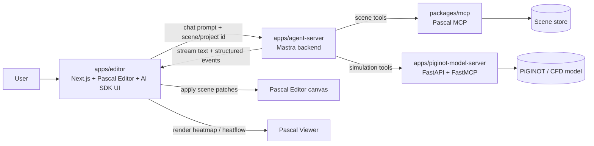
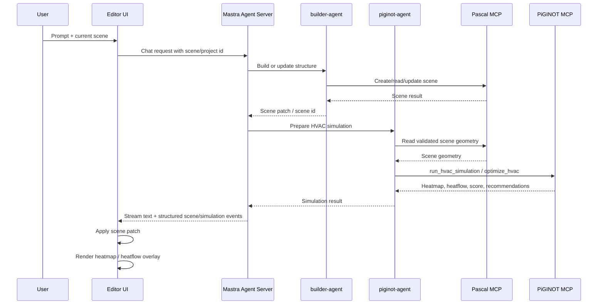

# chat PiGINOT Architecture

chat PiGINOT combines Pascal Editor, a Mastra agent backend, and a PiGINOT model server. The user can build a 3D room or house scene manually, ask an agent to generate one, then run HVAC simulation and visualize heatmap or heatflow results in the editor.

## Goals

- Let users create or edit 3D scenes in Pascal Editor.
- Let agents create and mutate scenes through Pascal MCP tools.
- Run CFD/HVAC simulation in a Python model backend.
- Stream agent responses to the UI while the editor applies scene and visualization updates.
- Keep AI orchestration, scene editing, and model inference separate.

## Monorepo Layout

```txt
apps/
  editor/                 # Next.js app, Pascal Editor, AI SDK chat UI
  agent-server/           # Mastra agents, memory, store, orchestration
  piginot-model-server/   # FastAPI + FastMCP, CFD/HVAC model serving

packages/
  core/                   # Pascal scene graph and pure domain logic
  viewer/                 # Pascal 3D viewer
  editor/                 # Reusable Pascal editor UI
  mcp/                    # Pascal MCP tools for scene operations
  nodes/                  # Pascal node definitions
  ui/                     # Shared UI primitives
```

`piginot-model-server` may temporarily exist as `piginot-backend`; the semantic target name is `piginot-model-server` because the service owns model serving and simulation, not general product backend logic.

## Service Boundaries



The UI should not own agent logic. It displays the chat stream, sends scene context, applies returned scene changes, and renders simulation overlays.

The Mastra backend is the AI control plane. It owns agents, routing, durable workflows, memory, store, and calls to MCP tools.

The PiGINOT model server is the physics and inference boundary. It owns preprocessing, model execution, postprocessing, and simulation result formatting.

## Agents

### builder-agent

Purpose: create and edit 3D structures from user prompts.

Tools:

- Pascal MCP scene tools.

Responsibilities:

- Create rooms, walls, floors, doors, windows, and furniture.
- Validate scene structure before returning changes.
- Ask for missing dimensions only when required.
- Avoid simulation claims.

Output:

- Scene patch or saved scene id.
- Human-readable summary.
- Validation warnings if the scene is incomplete.

### piginot-agent

Purpose: prepare HVAC simulation, call the PiGINOT model server, and optimize HVAC performance.

Tools:

- Pascal MCP scene tools for reading scene geometry.
- PiGINOT MCP tools for simulation and optimization.

Responsibilities:

- Extract simulation-ready geometry from the scene.
- Build HVAC configuration from prompt and scene data.
- Run simulation.
- Compare alternatives when optimization is requested.
- Return heatmap, heatflow, scores, and recommendations.

Output:

- Simulation result id or inline result.
- Heatmap and heatflow payloads for the editor.
- Recommended HVAC placement or configuration.
- Optional scene patch proposal.

## Request Flow



## MCP Tool Surface

The PiGINOT MCP server should expose a small curated tool set instead of every FastAPI route.

Initial tools:

```txt
run_hvac_simulation(scene, hvac_config, options)
optimize_hvac(scene, constraints, objective)
get_simulation_status(job_id)
get_simulation_result(job_id)
```

Later tools:

```txt
compare_hvac_options(scene, candidates, objective)
generate_heatmap(simulation_result)
generate_heatflow(simulation_result)
```

Keep large numerical arrays out of normal chat text. Return structured payloads with ids, metadata, and compact arrays suitable for visualization.

## Data Contracts

Minimum request payload from UI to Mastra:

```ts
type ChatRequest = {
  message: string
  sceneId?: string
  projectId?: string
  activeAgent?: 'builder-agent' | 'piginot-agent' | 'auto'
}
```

Minimum simulation result payload:

```ts
type SimulationResult = {
  id: string
  status: 'completed' | 'failed'
  efficiencyScore?: number
  heatmap?: {
    units: 'celsius'
    dimensions: [number, number, number]
    values: number[]
  }
  heatflow?: {
    vectors: Array<{
      position: [number, number, number]
      direction: [number, number, number]
      magnitude: number
    }>
  }
  recommendation?: string
}
```

Add a shared contracts package only after the same DTOs are duplicated across `apps/editor`, `apps/agent-server`, and `apps/piginot-model-server`.

## Runtime Modes

### Local Development

```txt
apps/editor               http://localhost:3002
apps/agent-server         Mastra dev server
apps/piginot-model-server http://localhost:8000
```

The editor sends chat requests to the Mastra agent server. The Mastra server connects to:

- Pascal MCP over stdio or HTTP.
- PiGINOT MCP over HTTP.

### Production

```txt
Editor web app
  -> Mastra agent service
    -> Pascal MCP / scene store
    -> PiGINOT model service
```

Scale `piginot-model-server` separately from `agent-server`. CFD/HVAC inference is CPU/GPU heavy; agent orchestration is mostly I/O and LLM calls.

## Ownership Rules

- `apps/editor` owns UI, chat rendering, editor state display, and visualization overlays.
- `apps/agent-server` owns AI orchestration, durable agents, memory, store, and tool routing.
- `packages/mcp` owns Pascal scene mutation tools.
- `apps/piginot-model-server` owns model inference, simulation, and optimization.
- Python model code should not import Pascal UI code.
- Next.js UI should not instantiate production Mastra agents directly.

## Near-Term Implementation Plan

1. Move chat execution out of `apps/editor/lib/mastra.ts` and route UI chat to `apps/agent-server`.
2. Register both MCP servers in Mastra:
   - Pascal MCP for scene operations.
   - PiGINOT MCP for simulation.
3. Add `builder-agent` and `piginot-agent` in `apps/agent-server`.
4. Replace broad FastAPI-to-MCP exposure with explicit PiGINOT MCP tools.
5. Stream structured events from Mastra to the UI for:
   - text response
   - scene patch
   - simulation result
   - heatmap or heatflow visualization

