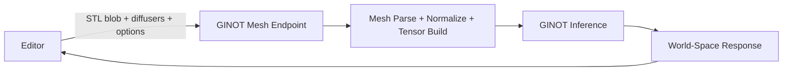

# Phase 1 Contract Freeze Implementation Plan

**Date**: 2026-03-21
**Type**: Feature Implementation
**Status**: Planning
**Context Tokens**: Freeze one backend-first contract before code changes begin. The editor should
send STL geometry plus semantic diffuser data in world coordinates. The backend should own mesh
parsing, normalization, tensor building, inference, and world-space response shaping. This phase
prevents a mixed architecture where some preprocessing remains in the frontend by accident.

## Executive Summary

Define the official request, response, and error contracts for backend-owned GINOT inference. This
phase removes ambiguity between the current frontend-built tensor flow and the target mesh-based
integration so the later implementation phases can converge on one supported path.

## Context Links

- **Related Plans**:
  `plans/260321-2117-ginot-backend-frontend-integration/plan.md`
- **Dependencies**:
  FastAPI backend contract, STL export path, diffuser detection in editor
- **Reference Docs**:
  `docs/ginot-backend-frontend-integration.md`,
  `docs/ginot-backend-api-specification.md`,
  `docs/ginot-model-interface.md`

## Requirements

### Functional Requirements

- [ ] Define one official editor request shape: `mesh + diffusers + options`
- [ ] Define one official backend response shape with world-space positions
- [ ] Define validation rules for mesh uploads and diffuser descriptors
- [ ] Define an explicit error matrix for 4xx and 5xx responses

### Non-Functional Requirements

- [ ] Contract must be simple enough for the frontend to implement without tensor logic
- [ ] Response semantics must be precise about units and coordinate space
- [ ] Contract must support extension for optional 3D grids without breaking MVP fields

## Architecture Overview



### Key Components

- **Editor request contract**: STL blob plus world-space diffuser descriptors
- **Backend validation contract**: mesh, diffuser, and quality-option validation
- **Response contract**: world-space fields renderable without frontend denormalization

### Data Models

- **`DiffuserInput`**: `id`, `kind`, `center`, optional `direction`, optional `airflowRate`
- **`GinotMeshRequest`**: `meshFile`, `diffusers`, optional `options`, optional `context`
- **`GinotMeshResponse`**: `positions`, `velocities`, `pressure`, `speed`, `bounds`, `metadata`

## Implementation Phases

### Phase 1: Request and Response Shape Definition (Est: 0.5 days)

**Scope**: Lock payload shape, units, and coordinate-space semantics

**Tasks**:
1. [ ] Rewrite the primary request contract in `docs/ginot-backend-frontend-integration.md`
2. [ ] Rewrite the API summary in `docs/ginot-backend-api-specification.md`
3. [ ] Add explicit world-space response semantics in `docs/ginot-model-interface.md`

**Acceptance Criteria**:
- [ ] The docs define one official mesh-based request shape
- [ ] Response positions are documented as world coordinates

### Phase 2: Validation and Error Semantics (Est: 0.5 days)

**Scope**: Define what the backend accepts and rejects

**Tasks**:
1. [ ] Add validation rules for STL uploads in `docs/ginot-backend-frontend-integration.md`
2. [ ] Add diffuser validation rules in `docs/ginot-backend-api-specification.md`
3. [ ] Add error cases and examples in `docs/ginot-backend-frontend-integration.md`

**Acceptance Criteria**:
- [ ] Mesh and diffuser validation rules are explicit
- [ ] Failure modes are documented with actionable messages

### Phase 3: Publication and Downstream Alignment (Est: 0.5 days)

**Scope**: Make this contract the source of truth for implementation phases

**Tasks**:
1. [ ] Link the phase docs from `plans/260321-2117-ginot-backend-frontend-integration/plan.md`
2. [ ] Mark frontend-built tensor mode as legacy/debug in the docs
3. [ ] Capture open API questions directly in the plan folder if unresolved

**Acceptance Criteria**:
- [ ] The main plan and the docs point to the same official contract
- [ ] Later phases do not depend on frontend normalization assumptions

## Testing Strategy

- **Unit Tests**: None in this phase; validate examples and schema tables by review
- **Integration Tests**: Cross-check request/response examples against backend phase docs
- **E2E Tests**: N/A until backend and client implementation exist

## Security Considerations

- [ ] Define acceptable mesh size and type constraints
- [ ] Avoid leaking internal backend stack traces in documented error responses

## Risk Assessment

| Risk | Impact | Mitigation |
|------|--------|------------|
| Docs preserve both old and new official contracts | High | Mark mesh mode as the only supported production path |
| Coordinate-space wording remains ambiguous | High | State world-space response semantics in every contract table |
| Multi-diffuser behavior is underspecified | Medium | Document MVP collapse/selection strategy explicitly |

## Quick Reference

### Key Commands

```bash
sed -n '1,220p' docs/ginot-backend-frontend-integration.md
sed -n '1,220p' docs/ginot-backend-api-specification.md
```

### Configuration Files

- `docs/ginot-backend-frontend-integration.md`: frontend/backend integration contract
- `docs/ginot-backend-api-specification.md`: backend endpoint specification
- `docs/ginot-model-interface.md`: model semantics and units

## TODO Checklist

- [ ] Official request contract documented
- [ ] Official response contract documented
- [ ] Validation rules documented
- [ ] Error matrix documented
- [ ] Legacy frontend tensor path marked as non-primary
- [ ] Main plan linked to phase docs
