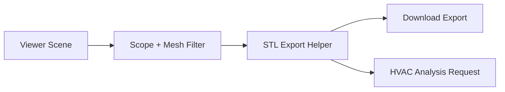

# Phase 3 Scene-To-STL Export Implementation Plan

**Date**: 2026-03-21
**Type**: Feature Implementation
**Status**: Planning
**Context Tokens**: The editor already exports STL for downloads via
`packages/editor/src/components/editor/export-manager.tsx`, but the logic is embedded in the UI
flow. This phase extracts that logic into a reusable in-memory export path so HVAC analysis can
send room geometry to the backend without requiring manual file management.

## Executive Summary

Refactor the current STL export path into a reusable analysis helper that returns an in-memory STL
blob. This phase keeps download export working while adding the backend-facing geometry path needed
for automated GINOT requests.

## Context Links

- **Related Plans**:
  `plans/260321-2117-ginot-backend-frontend-integration/plan.md`,
  `plans/260321-2117-ginot-backend-frontend-integration/phase-04-thin-client-migration.md`
- **Dependencies**:
  `scene-renderer`, `sceneRegistry`, `STLExporter`, viewer export store
- **Reference Docs**:
  `docs/ginot-backend-frontend-integration.md`

## Requirements

### Functional Requirements

- [ ] Export selected room geometry to STL without downloading a file
- [ ] Reuse the same export pipeline for both download and analysis
- [ ] Support export scoping to the selected level or zone
- [ ] Exclude non-room meshes and visualization overlays from the analysis STL

### Non-Functional Requirements

- [ ] Export should be deterministic for the same scene state
- [ ] Export should not block the UI longer than necessary
- [ ] Geometry filtering should be explicit and testable

## Architecture Overview



### Key Components

- **Export helper**: shared STL generation from scene objects
- **Scope filter**: select relevant level/zone geometry for analysis
- **Viewer export bridge**: keep current download export behavior intact

### Data Models

- **`ExportScope`**: selected `levelId`, `zoneId`, or full-scene fallback
- **`StlExportResult`**: `blob`, optional `fileName`, optional metadata such as face count

## Implementation Phases

### Phase 1: Extract Shared STL Helper (Est: 1 day)

**Scope**: Move export logic out of the UI component

**Tasks**:
1. [ ] Create `packages/editor/src/lib/hvac/scene-stl-export.ts`
2. [ ] Move `buildExportScene()` logic out of `packages/editor/src/components/editor/export-manager.tsx`
3. [ ] Export a helper that returns `Blob` or `ArrayBuffer`

**Acceptance Criteria**:
- [ ] Download export still works
- [ ] STL generation is callable without triggering a browser download

### Phase 2: Add Scope Filtering for Analysis (Est: 1 day)

**Scope**: Limit exported geometry to the analysis target

**Tasks**:
1. [ ] Add scope-selection input to `packages/editor/src/lib/hvac/scene-stl-export.ts`
2. [ ] Use level/zone selection data from `packages/viewer/src/store/use-viewer.ts`
3. [ ] Exclude non-structural meshes that should not influence inference

**Acceptance Criteria**:
- [ ] Analysis export contains only the intended room geometry
- [ ] Visualization-only nodes remain excluded

### Phase 3: Wire Export Helper for Analysis (Est: 0.5 days)

**Scope**: Make the helper available to the HVAC orchestration path

**Tasks**:
1. [ ] Expose analysis export helper via `packages/editor/src/lib/hvac/index.ts`
2. [ ] Keep download export wiring in `packages/editor/src/components/editor/export-manager.tsx`
3. [ ] Document the helper contract in the phase notes or code comments

**Acceptance Criteria**:
- [ ] `use-hvac-analysis` can request an in-memory STL blob in Phase 4
- [ ] The export path is not duplicated in two separate implementations

## Testing Strategy

- **Unit Tests**: geometry filtering and exclusion rules for the export helper
- **Integration Tests**: compare analysis export and download export on the same scene
- **E2E Tests**: smoke test that analysis can start from the selected room without manual upload

## Security Considerations

- [ ] Ensure only intended scene objects are serialized for backend upload
- [ ] Avoid unintentionally exporting overlays or hidden debug meshes

## Risk Assessment

| Risk | Impact | Mitigation |
|------|--------|------------|
| Analysis export includes extra geometry from outside the selected room | High | Add explicit level/zone-aware filtering before rollout |
| Download and analysis export diverge over time | Medium | Share one helper and keep UI wrappers thin |
| Exported mesh is too heavy for interactive requests | Medium | Start with filtered room scope and add quality controls later |

## Quick Reference

### Key Commands

```bash
bun dev
turbo run check-types
```

### Configuration Files

- `packages/editor/src/components/editor/export-manager.tsx`: current STL/GLB export wiring
- `packages/viewer/src/store/use-viewer.ts`: selection state and export hook bridge

## TODO Checklist

- [ ] Shared STL helper created
- [ ] Download export moved to shared helper
- [ ] Analysis export scope filtering added
- [ ] HVAC library export added
- [ ] Export helper verified against current scene data

