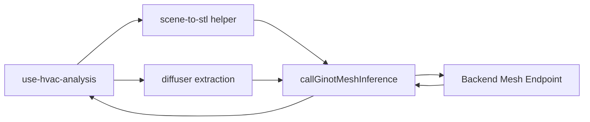

# Phase 4 Thin Client Migration Implementation Plan

**Date**: 2026-03-21
**Type**: Feature Implementation
**Status**: Planning
**Context Tokens**: The current GINOT path in `use-hvac-analysis.ts` builds room geometry,
samples points, normalizes coordinates, validates tensors, and denormalizes results in the
browser. This phase replaces that behavior with a thin client that sends STL plus semantic
diffuser data and receives a world-space backend response.

## Executive Summary

Migrate the frontend from a preprocessing-heavy GINOT client to a thin request orchestrator. This
phase removes runtime tensor-building logic from the browser and makes the backend mesh endpoint
the default GINOT execution path.

## Context Links

- **Related Plans**:
  `plans/260321-2117-ginot-backend-frontend-integration/plan.md`,
  `plans/260321-2117-ginot-backend-frontend-integration/phase-03-scene-to-stl-export.md`,
  `plans/260321-2117-ginot-backend-frontend-integration/phase-05-viewer-response-mapping.md`
- **Dependencies**:
  diffusers in scene state, STL helper, backend mesh endpoint
- **Reference Docs**:
  `docs/ginot-backend-frontend-integration.md`,
  `docs/ginot-backend-api-specification.md`

## Requirements

### Functional Requirements

- [ ] Add a mesh-based GINOT client request using multipart form data
- [ ] Build request payload from STL blob and world-space diffuser descriptors
- [ ] Stop using frontend GINOT sampling and normalization helpers at runtime
- [ ] Preserve loading, timeout, and error handling in the UI

### Non-Functional Requirements

- [ ] Request path should remain synchronous and abortable
- [ ] Legacy surrogate-model flow should remain isolated and functional
- [ ] Frontend code should clearly show that GINOT preprocessing is backend-owned

## Architecture Overview



### Key Components

- **GINOT client**: multipart request builder and timeout/error handling
- **HVAC analysis hook**: orchestration layer for room scope, diffusers, and response handling
- **Legacy boundary**: keep old surrogate model flow separate from the new GINOT mesh flow

### Data Models

- **`DiffuserInput`**: supply/return semantics in world coordinates
- **`GinotMeshRequest`**: STL blob plus diffusers and optional quality preset
- **`GinotMeshResponse`**: direct backend response to be mapped into node storage

## Implementation Phases

### Phase 1: Add Mesh Client Surface (Est: 0.5 days)

**Scope**: Introduce the new request function and types

**Tasks**:
1. [ ] Extend `packages/editor/src/lib/hvac/ai-inference-client.ts`
2. [ ] Export mesh-client types from `packages/editor/src/lib/hvac/index.ts`
3. [ ] Preserve request timeout and error normalization in the client

**Acceptance Criteria**:
- [ ] Frontend can send multipart request with STL and diffuser JSON
- [ ] Errors surface with actionable messages

### Phase 2: Migrate `use-hvac-analysis` Runtime Path (Est: 1 day)

**Scope**: Replace runtime tensor building with thin orchestration

**Tasks**:
1. [ ] Update `packages/editor/src/hooks/use-hvac-analysis.ts`
2. [ ] Build diffuser descriptors from existing detector output
3. [ ] Call the Phase 3 STL helper instead of frontend GINOT preprocessing helpers
4. [ ] Remove runtime calls to `buildGinotInput()`, `validateGinotInput()`, and `denormalizePoints()`

**Acceptance Criteria**:
- [ ] Browser runtime no longer builds `load`, `pc`, or `xyt` for GINOT
- [ ] GINOT request body contains only geometry, semantic boundary data, and options

### Phase 3: Remove Legacy UI Assumptions (Est: 0.5 days)

**Scope**: Align UI state with the backend-first path

**Tasks**:
1. [ ] Deprecate or remove `ginotMode` toggling in `packages/editor/src/hooks/use-hvac-analysis.ts`
2. [ ] Keep surrogate-model path isolated behind its own branch
3. [ ] Update comments and naming in `packages/editor/src/lib/hvac/ai-inference-client.ts`

**Acceptance Criteria**:
- [ ] The GINOT path is clearly backend-first by default
- [ ] Legacy flow remains available only where intentionally supported

## Testing Strategy

- **Unit Tests**: request-payload shaping for diffusers and multipart fields
- **Integration Tests**: one frontend smoke path from selected room to backend response
- **E2E Tests**: run HVAC analysis from the UI without manual mesh upload

## Security Considerations

- [ ] Do not send hidden debug-only data or unnecessary scene metadata to the backend
- [ ] Preserve timeout behavior so failed requests do not hang the UI indefinitely

## Risk Assessment

| Risk | Impact | Mitigation |
|------|--------|------------|
| Thin client still depends on frontend normalization helpers indirectly | High | Treat any runtime use of those helpers as a migration failure |
| Diffuser payload does not match backend expectations | High | Lock the contract in Phase 1 before coding |
| Legacy AI client and GINOT client code become entangled | Medium | Keep separate request types and explicit branches |

## Quick Reference

### Key Commands

```bash
bun dev
turbo run check-types
```

### Configuration Files

- `packages/editor/src/lib/hvac/ai-inference-client.ts`: request client surface
- `packages/editor/src/hooks/use-hvac-analysis.ts`: orchestration and node updates
- `packages/editor/src/lib/hvac/index.ts`: HVAC public exports

## TODO Checklist

- [ ] Mesh client added
- [ ] Multipart request contract implemented
- [ ] `use-hvac-analysis` migrated to STL plus diffusers
- [ ] Runtime tensor-building calls removed from GINOT path
- [ ] `ginotMode` assumptions cleaned up

