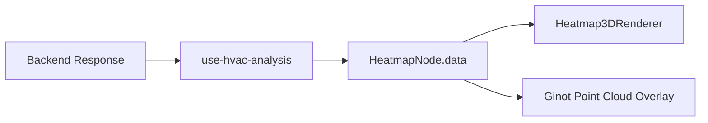

# Phase 5 Viewer Response Mapping Implementation Plan

**Date**: 2026-03-21
**Type**: Feature Implementation
**Status**: Planning
**Context Tokens**: Once the backend returns world-space GINOT results, the frontend should store
and render them without reprocessing geometry. This phase maps backend output into the existing
HeatmapNode and viewer renderer contracts while keeping airflow semantics honest: GINOT provides
speed, pressure, and velocity, not temperature or comfort metrics.

## Executive Summary

Map backend response fields directly into existing viewer storage and rendering paths. This phase
keeps the frontend thin after the request returns and prevents the renderer from depending on
frontend-side denormalization or invented scalar fields.

## Context Links

- **Related Plans**:
  `plans/260321-2117-ginot-backend-frontend-integration/plan.md`,
  `plans/260321-2117-ginot-backend-frontend-integration/phase-04-thin-client-migration.md`,
  `plans/260319-0926-ginot-pointcloud-heatmap/plan.md`
- **Dependencies**:
  HeatmapNode schema, point-cloud overlay renderer, HVAC analysis hook
- **Reference Docs**:
  `docs/ginot-backend-frontend-integration.md`,
  `docs/ginot-model-interface.md`

## Requirements

### Functional Requirements

- [ ] Store backend `positions`, `velocities`, `pressure`, and `speed` directly in node data
- [ ] Populate `ginotPointCloud`, `speedField`, and `pressureField` without denormalization
- [ ] Accept optional backend-provided 3D grids if available
- [ ] Keep renderer behavior safe when only point-cloud data exists

### Non-Functional Requirements

- [ ] Point cloud must align spatially with room geometry without extra transforms
- [ ] Renderer performance should remain acceptable for typical point counts
- [ ] UI semantics must stay honest about what GINOT actually predicts

## Architecture Overview



### Key Components

- **Response mapper**: convert backend arrays into node-safe data structures
- **HeatmapNode schema**: storage contract for point-cloud and optional grid fields
- **Viewer renderers**: render world-space GINOT output without extra transforms

### Data Models

- **`GinotPointCloudPoint`**: `position`, `velocity`, `pressure`, `speed`
- **`HeatmapData` additions**: `ginotPointCloud`, `speedField`, `pressureField`, optional 3D fields

## Implementation Phases

### Phase 1: Align Storage Schema (Est: 0.5 days)

**Scope**: Ensure node data can store the backend response directly

**Tasks**:
1. [ ] Review and update `packages/core/src/schema/nodes/heatmap.ts`
2. [ ] Confirm `ginotPointCloud`, `speedField`, and `pressureField` match the backend shape
3. [ ] Add optional backend-owned 3D field storage if needed

**Acceptance Criteria**:
- [ ] Node schema accepts the world-space backend response without extra transforms
- [ ] GINOT-only nodes remain renderer-safe

### Phase 2: Map Response in the Hook (Est: 0.5 days)

**Scope**: Convert response arrays into stored node data

**Tasks**:
1. [ ] Update response-mapping logic in `packages/editor/src/hooks/use-hvac-analysis.ts`
2. [ ] Remove any remaining denormalization in the GINOT storage path
3. [ ] Preserve existing heatmap data when overlaying GINOT points onto an existing node

**Acceptance Criteria**:
- [ ] Hook stores backend results directly
- [ ] Existing heatmap content is not accidentally wiped

### Phase 3: Verify Rendering Semantics (Est: 1 day)

**Scope**: Confirm viewer output remains correct and honest

**Tasks**:
1. [ ] Review `packages/viewer/src/components/renderers/heatmap/heatmap-3d-renderer.tsx`
2. [ ] Review `packages/viewer/src/components/renderers/heatmap/ginot-point-cloud.tsx`
3. [ ] Verify color bounds and metric selection for speed and pressure

**Acceptance Criteria**:
- [ ] Point cloud renders in the expected world position
- [ ] Speed and pressure metrics render correctly

## Testing Strategy

- **Unit Tests**: mapper logic from backend response arrays to node data
- **Integration Tests**: render a fixture response through the hook and viewer
- **E2E Tests**: run one GINOT analysis and confirm point cloud overlay alignment

## Security Considerations

- [ ] Do not trust backend numeric arrays blindly; validate lengths before storage
- [ ] Avoid renderer crashes from malformed or partial backend responses

## Risk Assessment

| Risk | Impact | Mitigation |
|------|--------|------------|
| Renderer still assumes normalized coordinates | High | Remove denormalization logic and verify with room-alignment tests |
| Heatmap node semantics become misleading | Medium | Keep GINOT fields limited to airflow metrics and explicit names |
| Large point clouds cause viewer slowdown | Medium | Reuse existing overlay controls and buffer-based rendering |

## Quick Reference

### Key Commands

```bash
bun dev
turbo run check-types
```

### Configuration Files

- `packages/core/src/schema/nodes/heatmap.ts`: stored data contract
- `packages/editor/src/hooks/use-hvac-analysis.ts`: response mapping
- `packages/viewer/src/components/renderers/heatmap/heatmap-3d-renderer.tsx`: viewer integration

## TODO Checklist

- [ ] Heatmap schema aligned with backend response
- [ ] Hook mapping updated
- [ ] Remaining GINOT denormalization removed
- [ ] Renderer verified for speed and pressure
- [ ] GINOT-only nodes render safely

