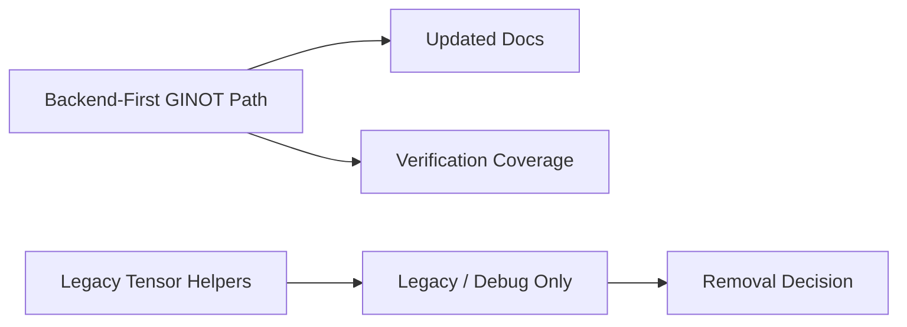

# Phase 6 Cleanup And Rollout Implementation Plan

**Date**: 2026-03-21
**Type**: Feature Implementation
**Status**: Planning
**Context Tokens**: After the backend-first path is working, the repo still contains older
frontend GINOT helpers and JSON tensor assumptions. This phase cleans up dead paths, updates docs,
and defines the rollout sequence so the backend-owned integration becomes the supported default
without breaking legacy HVAC flows prematurely.

## Executive Summary

Deprecate the old frontend-owned GINOT path and formalize the backend-first rollout. This phase
updates docs, removes dead exports, adds verification coverage, and defines the decision point for
removing legacy utilities after a stabilization window.

## Context Links

- **Related Plans**:
  `plans/260321-2117-ginot-backend-frontend-integration/plan.md`,
  `plans/260321-2117-ginot-backend-frontend-integration/phase-04-thin-client-migration.md`,
  `plans/260321-2117-ginot-backend-frontend-integration/phase-05-viewer-response-mapping.md`
- **Dependencies**:
  backend mesh endpoint, migrated frontend path, existing legacy surrogate model
- **Reference Docs**:
  `docs/ginot-backend-frontend-integration.md`,
  `docs/ginot-backend-api-specification.md`

## Requirements

### Functional Requirements

- [ ] Mark old frontend-built tensor mode as legacy/debug only
- [ ] Remove dead public exports tied to the old runtime path
- [ ] Add verification coverage for happy path and failure modes
- [ ] Document rollout and removal criteria for legacy utilities

### Non-Functional Requirements

- [ ] Rollout should minimize regression risk to existing HVAC analysis flows
- [ ] Deprecation should be visible in docs and code comments
- [ ] Verification should cover backend and frontend boundaries together

## Architecture Overview



### Key Components

- **Documentation updates**: make the mesh endpoint the supported default
- **Legacy cleanup**: remove dead exports and isolate debug-only helpers
- **Verification suite**: backend fixtures plus frontend smoke coverage

### Data Models

- **Legacy runtime helpers**: `buildGinotInput`, `point-sampler`, `normalization`
- **Supported public surface**: mesh client, response mapper, backend-first docs

## Implementation Phases

### Phase 1: Deprecation and Documentation (Est: 0.5 days)

**Scope**: Make the supported path explicit

**Tasks**:
1. [ ] Update `docs/ginot-backend-frontend-integration.md`
2. [ ] Update `docs/ginot-backend-api-specification.md`
3. [ ] Add deprecation notes in `packages/editor/src/lib/hvac/index.ts`

**Acceptance Criteria**:
- [ ] Docs identify the backend-first mesh path as the default
- [ ] Old tensor path is clearly marked non-primary

### Phase 2: Verification Coverage (Est: 1 day)

**Scope**: Verify both happy path and failure handling

**Tasks**:
1. [ ] Add backend integration coverage in `backend/tests/`
2. [ ] Add frontend smoke coverage around `packages/editor/src/hooks/use-hvac-analysis.ts`
3. [ ] Verify malformed mesh, missing diffuser, timeout, and backend-unavailable handling

**Acceptance Criteria**:
- [ ] Core failure modes are covered by automated tests or explicit smoke procedures
- [ ] Backend and frontend integration boundaries are exercised together

### Phase 3: Removal Decision and Rollout Gate (Est: 0.5 days)

**Scope**: Decide what stays for one cycle and what can be removed

**Tasks**:
1. [ ] Audit remaining legacy exports in `packages/editor/src/lib/hvac/index.ts`
2. [ ] Decide whether old runtime helpers stay for fixtures only or are deleted
3. [ ] Record rollout status in `plans/260321-2117-ginot-backend-frontend-integration/plan.md`

**Acceptance Criteria**:
- [ ] The repo has one documented default path for GINOT
- [ ] Legacy code status is explicit rather than accidental

## Testing Strategy

- **Unit Tests**: cleanup audits and response-shape validation helpers
- **Integration Tests**: backend fixture inference plus frontend smoke request path
- **E2E Tests**: one complete editor analysis flow after the backend-first migration

## Security Considerations

- [ ] Ensure deprecated code paths are not silently used in production
- [ ] Verify error handling does not expose backend internals during rollout

## Risk Assessment

| Risk | Impact | Mitigation |
|------|--------|------------|
| Legacy helpers remain reachable from production code | High | Add explicit deprecation notes and remove dead exports |
| Rollout breaks surrogate-model flows unexpectedly | Medium | Keep legacy surrogate path isolated and verify it separately |
| Docs and code drift again after rollout | Medium | Update both in the same cleanup phase and record status in the main plan |

## Quick Reference

### Key Commands

```bash
bun dev
turbo run check-types
python -m pytest backend/tests
```

### Configuration Files

- `plans/260321-2117-ginot-backend-frontend-integration/plan.md`: migration status and phase index
- `packages/editor/src/lib/hvac/index.ts`: public HVAC export surface
- `docs/ginot-backend-frontend-integration.md`: supported integration contract

## TODO Checklist

- [ ] Docs updated for backend-first default
- [ ] Dead exports removed or deprecated
- [ ] Verification coverage added
- [ ] Legacy runtime helper status decided
- [ ] Main plan updated with rollout state
